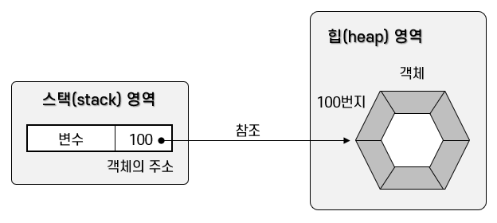

# Java-Study

## Class

### 1. 객체 지향 프로그래밍(Object Oriented Programming)

부품에 해당하는 **객체**들을 먼저 만들고, 객체들을 하나씩 조립해서 완성된 프로그램을 만드는 기법을 **객체 지향 프로그래밍(OOP: Object Oriented Programming)** 이라고 한다.

#### 1.1 객체

**객체(Object)** 란 물리적으로 존재하거나 추상적으로 생각할 수 있는 것 중에서 자신의 속성을 가지고 있고 다른 것과 식별 가능한 것을 말한다.
객체는 **속성**과 **동작**으로 구성되어 있으며, 자바는 이러한 속성과 동작들을 각각 **필드(Field)** 와 **메소드(Method)** 라고 부른다.


현실 세계의 객체를 소프트웨어 객체로 설계하는 것을 **객체 모델링(Object Modeling)** 이라고 한다. 객체 모델링은 현실 세계의 객체의 속성과 동작을 추려내어 소프트웨어 객체의 필드와 메소드로 정의하는 과정이라고 볼 수 있다.

<hr>

#### 1.2 객체의 상호작용

객체들은 각각 독립적으로 존재하고, 다른 객체와 서로 상호작용 하면서 동작한다. 객체들 사이의 상호작용 수단은 **메소드**이다. **객체가 다른 객체의 기능을 이용하는 것**이 바로 **메소드 호출**이다.

메소드 호출은 다음과 같은 형태를 가지고 있다. 객체에 도트(.) 연산자를 붙이고 메소드 이름을 기술하면 된다. 도트 연산자는 객체의 필드와 메소드에 접근할 때 사용한다.

> 리턴값 = 전자계산기객체.메소드(매개값1, 매개값2, ...);

**매개값은 메소드를 실행하기 위해 필요한 데이터이다.** 예를 들어 10과 20을 주고 더하기 기능을 이용한다고 했을 때 10과 20이 더하기 기능의 매개값이다. **리턴값은 메소드가 실행하고 나서 호출한 곳으로 돌려주는(리턴하는) 값이다.**


자바 코드로 본 메소드 호출

```java
 int result = Calculator.add(10, 20);
 //리턴한 값을 int 변수에 저장
```

<hr>

#### 1.3 객체 간의 관계

객체는 개별적으로 사용될 수 있지만, 대부분 다른 객체와 관계를 맺고 있다. 이 관계의 종류에는 집합 관계, 사용 관계, 상속 관계가 있다. **집합 관계에 있는 객체는 하나의 부품이고 하나는 완성품에 해당한다.** 예를 들어 자동차는 엔진, 타이어, 핸들 등으로 구성되므로 자동차와 이 부품들은 집합의 관계라고 볼 수 있다.


**사용 관계는 객체 간의 상호작용을 말한다.** 객체는 다른 객체의 메소드를 호출하여 원하는 결과를 얻어낸다. 예를 들어 사람은 자동차를 사용하므로 사람과 자동차는 사용의 관계라고 볼 수 있다. 사람은 자동차를 사용할 때 달린다, 멈춘다 등의 메소드를 호출한다.

**상속 관계는 상위(부모) 객체를 기반으로 하위(자식) 객체를 생성하는 관계를 말한다.** 일반적으로 상위 객체는 종류를 의미하고, 하위 객체는 구체적인 사물에 해당한다. 예를 들어 "자동차는 기계의 종류이다."에서 기계(상위)와 자동차(하위)는 상속 관계에 있다고 볼 수 있다.

> 객체 지향 프로그래밍(OOP)은 만들고자 하는 완성품인 객체를 모델링하고, 집합 관계에 있는 부품 객체와 사용 관계에 있는 개체를 하나씩 설계한 후 조립하는 방식으로 프로그램을 개발하는 기법이다.

<hr>

#### 1.4 객체 지향 프로그래밍의 특징

#### 캡슐화(Encapsulation)

**캡슐화란 객체의 필드, 메소드를 하나로 묶고, 실제 구현 내용을 감추는 것을 말한다.** 외부 객체는 객체 내부의 구조를 알지 못하며 객체가 노출해서 제공하는 필드와 메소드만 이용할 수 있다.


**_필드와 메소드를 캡슐화하여 보호하는 이유는 외부의 잘못된 사용으로 인해 객체가 손상되지 않도록 하는 데에 있다._** (전자제품의 중요한 부품이 바깥으로 노출되는 경우 사용자가 실수로 고장을 유발할 수 있기 때문에 패키징을 통해 접근을 차단하는 것과 유사)
자바 언어는 캡슐화된 멤버를 노출시킬 것인지, 숨길 것인지를 결정하기 위해 **접근 제한자(Access Modifier)** 를 사용한다. **_접근 제한자는 객체의 필드와 메소드의 사용 범위를 제한함으로써 외부로부터 보호한다._**

</br>

#### 상속(Inheritance)

일상 언어로서의 상속은 부모가 가지고 있는 재산을 자식에게 물려주는 것을 의미한다. 자식은 특별한 노력 없이 부모가 물려준 재산을 갖게 된다. 이와 비슷하게 객체 지향 프로그래밍에서도 부모 역할의 상위 객체와 자식 역할의 하위 객체가 있다. **상위 객체는 자기가 가지고 있는 필드와 메소드를 하위 객체에게 물려주어 하위 객체가 사용할 수 있도록 해준다.**


**_1. 상속은 상위 객체를 재사용해서 하위 객체를 쉽고 빨리 설계할 수 있도록 도와주고, 이미 잘 개발된 객체를 재사용해서 새로운 객체를 만들기 때문에 반복된 코드의 중복을 줄여준다._**

**_2. 상속은 상위 객체의 수정으로 모든 하위 객체들의 수정 효과를 가져오므로 유지 보수 시간을 최소화시켜주기도 한다._**

</br>

#### 다형성(Polymorphism)

**다형성은 같은 타입이지만 실행 결과가 다양한 객체를 이요할 수 있는 성질을 말한다.** 코드 측면에서 보면 다형성은 하나의 타입에 여러 객체를 대입함으로써 다양한 기능을 이용할 수 있도록 해준다. 자바는 다형성을 위해 부모 클래스 또는 인터페이스의 타입 변환을 허용한다. **_부모 타입에는 모든 자식 객체가 대입될 수 있고, 인터페이스 타입에는 모든 구현 객체가 대입될 수 있다._**

<hr></br>

### 2. 객체와 클래스

메모리에서 사용하고 싶은 객체가 있다면 우선 설계도로 해당 객체를 만드는 작업이 필요하다. **자바에서는 설계도가 바로 클래스(class)이다.** 클래스에는 객체를 생성하기 위한 필드와 메소드가 정의되어 있다. **클래스로부터 만들어진 객체를 해당 클래스의 인스턴스(instance)라고 한다.**

> **<객체 지향 프로그래밍 개발 단계>** </br> > **1단계.** 클래스 설계 </br> > **2단계.** 설계된 클래스를 이용하여 사용할 객체 생성 </br> > **3단계.** 생성된 객체 이용 </br>

<hr></br>

### 3. 클래스 선언

사용하고자 하는 객체를 구상했다면, 그 객체의 대표 이름을 정하고 그것을 클래스 이름으로 한다. 클래스 이름은 다른 클래스와 식별할 목적으로 사용되므로 자바의 식별자 작성 규칙에 따라서 만들어야 한다.

> **작성 규칙**
>
> 1. 하나 이상의 문자로 이루어져야 한다.
> 2. 첫 번째 글자는 숫자가 올 수 없다.
> 3. '\$', '\_' 외의 특수 문자는 사용할 수 없다.
> 4. 자바 키워드는 사용할 수 없다. e.g. int(x), for(x), etc.

관례적으로 클래스 이름이 단일 단어라면 첫 글자를 대문자로 하고 나머지는 소문자로 작성한다. 만약 서로 다른 단어가 혼합된 이름을 사용한다면 각 단어의 첫 머리 글자는 대문자로 작성하는 것이 관례이다.

> Calculator, Car, Member, ChatClient, ChatServer, Web_Browser, etc.

클래스 이름을 정했다면 "클래스 이름.java"로 소스 파일을 생성해야 한다. 소스 파일 생성 후 소스 파일을 열고 다음과 같이 클래스를 선언한다.

```java
public class ClassName {

}
```

일반적으로 소스 파일당 하나의 클래스를 선언하지만, 두 개 이상의 클래스 선언도 가능하다.

```java
public class Car{

}


class Tire{

}
```

두 개 이상의 클래스가 선언된 소스 파일을 컴파일하면 바이트 코드 파일은(.class) 클래스를 선언한 개수만큼 생긴다. 결국 소스파일은 클래스 선언을 담고 있는 저장 단위일 뿐, 클래스 자체가 아니다. (상기 코드를 컴파일하면 Car.class와 Tire.class 생성)

> **주의할 점 : 파일 이름과 동일한 이름의 클래스 선언에만 public 접근 제한자를 붙일 수 있다.** </br>
> 따라서 가급적이면 소스 파일 하나당 동일한 이름의 클래스 하나를 선언하는 것이 좋다. (파일 이름과 상이한 클래스 선언에 public 접근 제한자를 붙이면 컴파일 에러 발생)

<hr></br>

### 4. 객체 생성과 클래스 변수

클래스 선언 후 컴파일을 했다면 객체를 생성할 설계도가 만들어진 셈이다. </br>
**클래스로부터 객체를 생성하는 방법은 다음과 같이 new 연산자를 사용하면 된다.**

```java
new ClassName();
```


**new는 클래스로부터 객체를 생성시키는 연산자이다. new 연산자 뒤에는 생성자가 오는데, 생성자는 클래스() 형태를 가지고 있다.** new 연산자로 생성된 객체는 메모리 힙(heap) 영역에 생성된다. 현실 세계에서 물건의 위치를 모르면 물건을 사용할 수 없듯, **_객체 지향 프로그램에서도 메모리 내에서 생성된 객체의 위치를 모르면 객체를 사용할 수 없다._** 그래서 new 연산자는 힙 영역에 객체를 생성시킨 후, 객체의 주소를 리턴하도록 되어 있다. 이 주소를 참조 타입인 클래스 변수에 저장해 두면, 변수를 통해 객체를 사용할 수 있다.
다음은 클래스 타입으로 선언된 변수에 new 연산자가 리턴한 객체의 주소를 저장하는 코드이다.

```java
Class variable;
variable = new Class();
```

클래스 변수 선언과 객체 생성을 한 개의 실행문으로 작성할 수 있다.

```java
Class variable = new Class();
```

이렇게 new 연산자로 객체를 생성하고 리턴된 객체의 주소를 변수에 저장하면 변수가 객체를 참조하게 된다.



**Example**
Student 클래스 선언 - StudentExample 클래스의 main() 메소드에서 Student 객체 생성

```java
//[Student.java] 클래스 선언
public class Student {

}
```

```java
//[StudentExample.java] 클래스로부터 객체 생성
public class StudentExample {
    public static void main(String[] args){
        Student s1 = new Student();
        System.out.println("s1 변수가 Student 객체를 참조합니다.");

        Student s2 = new Student();
        System.out.println("s2 변수가 또 다른 Student 객체를 참조합니다.");
    }
}
```

> 예제가 실행되면 다음 그림과 같이 메모리에 클래스 변수와 객체가 생성된다. **Student 클래스는 하나지만 new 연산자를 사용한 만큼 객체가 메모리에 생성된다.** 이러한 객체들은 Student 클래스의 instance들이다. 비록 같은 클래스로부터 생성되었지만 각각의 Student 객체는 자신만의 고유 데이터를 가지면서 메모리에서 활동하게 된다. **s1과 s2가 참조하는 Student 객체는 완전히 독립된 서로 다른 객체이다.**


그렇다면 Student와 StudentExample 클래스의 용도는 무엇일까?
**클래스는 두 가지 용도가 있다. 하나는 라이브러리(API: Application Program Interface)용이고, 다른 하나는 실행용이다. 라이브러리 클래스는 다른 클래스에서 이용할 목적으로 설계된다.** 프로그램 전체에서 사용되는 클래스가 100개라면 99개는 라이브러리이고, 단 하나가 실행 클래스이다. **실행 클래스는 프로그램의 실행 진입점인 main() 메소드를 제공하는 역할을 한다.** Student는 라이브러리 클래스이고 StudentExample은 실행 클래스이다. Student에 main() 메소드를 작성해서 라이브러리인 동시에 실행 클래스로 만들 수도 있다.

```java
public class Student {
    //라이브러리로서의 코드(필드, 생성자, 메소드)
    ...

    //실행하기 위한 코드
    public static void main(String[] args){
        Student s1 = new Student();
        System.out.println("s1 변수가 Student 객체를 참조합니다.");

        Student s2 = new Student();
        System.out.println("s2 변수가 또 다른 Student 객체를 참조합니다.");
    }
}

```

프로그램이 단 하나의 클래스로 구성된다면 위와 같이 작성하는 것이 좋을 수도 있으나(e.g. 코딩 테스트), 대부분의 객체 지향 프로그램은 라이브러리(부품 객체 및 완성 객체)와 실행 클래스를 분리하여 사용한다.

<hr></br>

### 5. 클래스의 구성 멤버

클래스에는 객체가 가져야 할 구성 멤버가 선언된다. 구성 멤버에는 **필드(Field), 생성자(Constructor), 메소드(Method)** 가 있다. 이 구성 멤버들은 생략되거나 복수 개가 작성될 수 있다.

```java
public class ClassName {
    // Field : 객체의 데이터가 저장되는 곳
    int fieldName;

    // Constructor : 객체 생성 시 초기화 역할 담당
    ClassName(){...}

    // Method : 객체의 동작에 해당하는 실행 블록
    void methodName(){...}
}
```

#### 5.1 필드(Field)

**필드는 객체의 고유 데이터, 부품 객체, 상태 정보를 저장하는 곳이다.** 선언 형태는 변수(variable)와 비슷하지만, 필드를 변수라고 부르지 않는다.

> **변수(Variable) -** 생성자와 메소드 내에서만 사용, 생성자와 메소드가 실행 종료되면 자동 소멸.
> **필드(Field) -** 생성자와 메소드 전체에서 사용, 객체가 소멸하지 않는 한 객체와 함께 존재.

<hr>

#### 5.2 생성자(Constructor)

생성자는 new 연산자로 호출되는 특별한 중괄호 {} 블록이다. **생성자의 역할은 객체 생성 시 초기화를 담당한다.** 필드를 초기화하거나, 메소드를 호출해서 객체를 사용할 준비를 한다. 생성자는 메소드와 비슷하게 생겼지만, _**클래스 이름으로 되어 있고 리턴 타입이 없다.**_

<hr>

#### 5.3 메소드(Method)

**메소드는 객체의 동작에 해당하는 중괄호 {} 블록을 말한다.** 중괄호 블록은 이름을 가지고 있는데, 이것이 메소드 이름이다. **메소드를 호출하게 되면 중괄호 블록에 있는 모든 코드들이 일괄적으로 실행된다.** 메소드는 필드를 읽고 수정하는 역할도 하지만, 다른 객체를 생성해서 다양한 기능을 수행하기도 한다. **메소드는 객체 간의 데이터 전달의 수단으로 사용된다.** 외부로부터 매개값을 받을 수도 있고, 실행 후 어떤 값을 리턴할 수도 있다.

<hr></br>

### 6. 필드(Field)
